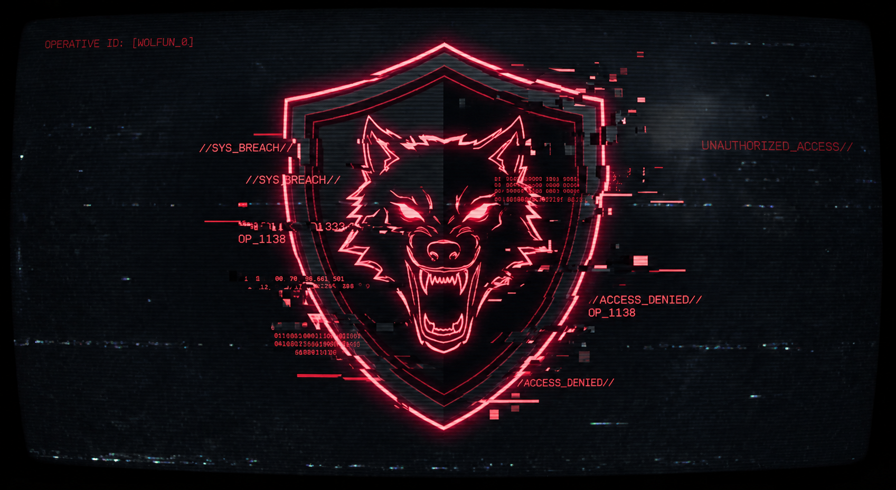

<div align="center">

# ⚡ OPERATIVE TERMINAL: INDRAKENZO

`[SYSTEM: ONLINE]` • `[CLEARANCE: LEVEL 9]` • `[LOCATION: MAKASSAR_ID]`



### ▓▓▓ [ GAME ARCHITECT & CYBERSEC OPERATIVE ] ▓▓▓

*"Constructing realities, deconstructing firewalls, and writing the shadows."*

[](https://git.io/typing-svg)

</div>

---

# 🧠 CURRENT OPERATIONS

```text
[+] Exploring Cyber Security & Penetration Testing
[+] Building Python Automation Tools & Security Libraries
[+] Developing AI-Assisted Systems
[+] Designing Game Worlds & Interactive Experiences
[+] Architecting the "For Revenge" Universe

🛡️ TACTICAL LOADOUT
💻 Custom Operating System
�

Silentium OS
Experimental custom operating system concept focused on:
🔒 Privacy-first architecture
🛡️ Security-oriented environment
⚡ Tactical interface design
🧠 AI-assisted workflow integration
⚔️ DEVELOPMENT ARSENAL
Primary Technology Stack
Languages:
├── Python
├── JavaScript
├── HTML/CSS
└── Shell Script

Security:
├── OSINT
├── Reconnaissance
├── Penetration Testing
└── Security Automation

Creative:
├── Game Architecture
├── World Building
├── Story System Design
└── Interactive Experience Development

📂 ACTIVE MISSIONS & DEPLOYED PROJECTS
Repository archive and development operations.
Mission Code
Category
Objective / Target
Status
For-Revenge
📜 Creative Project
Fiction architecture, thriller universe, character development, and story system design
🔐 ENCRYPTED
SilentiumShield-Recon
🛡️ Cyber Ops
Tactical reconnaissance tool based on Silentium Shield protocol
🟢 ACTIVE
OSINT-Probe
🛡️ Cyber Security
OSINT reconnaissance toolkit for information gathering
🟢 STABLE
Recon-Spectre
🔍 Security Research
Reconnaissance framework and automation experiments
🟡 UPDATING
HostHunter
🌐 Network Tool
Network intelligence and host analysis utility
🟢 STABLE
VeVoLib
⚙️ Security Library
Modular security utility collection built with Python
🟢 STABLE
Purple-tools-by.indra
🧰 Cyber Tools
Purple Team utility scripts and security tools collection
🟢 ACTIVE
quran
📱 Application Development
Digital application deployment and utility structure
🟢 STABLE
📊 SYSTEM DIAGNOSTICS & TELEMETRY
�

📡 LIVE GITHUB ACTIVITY STREAM
�


�

🏆 TACTICAL ACHIEVEMENTS
�

⏱️ WAKATIME TERMINAL LOGS
[WAITING FOR DATA STREAM...]

WakaTime API integration will be injected automatically
when GitHub Actions workflow is activated.
👁️ INTRUSION DETECTION
Visitor Counter
�

�

🔗 OPERATIVE PROFILE
�

"Building systems. Breaking limits. Creating digital realities."
�
`
