<!-- Generated by GitHub Profile Agent Console. Edit profile.config.json, then run npm run generate. -->

  <picture>
    <source media="(max-width: 760px) and (prefers-color-scheme: dark)" srcset="./assets/hero/agent-console-6decdbe7-mobile-dark.svg">
    <source media="(max-width: 760px)" srcset="./assets/hero/agent-console-6decdbe7-mobile-light.svg">
    <source media="(prefers-color-scheme: dark)" srcset="./assets/hero/agent-console-6decdbe7-dark.svg">
    <source media="(prefers-color-scheme: light)" srcset="./assets/hero/agent-console-6decdbe7-light.svg">
    
  </picture>

  

## About Me

Sebagai sarjana Manajemen, saya memadukan kepatuhan finansial dan audit dengan ketajaman analisis keamanan siber.

Fokus saya adalah mendeteksi anomali di neraca keuangan sekaligus membedah residu biner untuk menjaga resiliensi arsitektur digital.

## Current Focus

| Area | What I am exploring |
| --- | --- |
| **Financial & Tax** | Kepatuhan hukum dan audit finansial tingkat tinggi bersertifikasi Brevet A & B serta Izin Kuasa Hukum Perpajakan. |
| **Offensive Security** | Certified Red Team Operations Management, penetration testing, dan pembedahan anatomi kode. |
| **Business & Marketing** | Penerapan analisis akuntansi yang akurat serta implementasi strategi digital marketing yang terukur. |

## Featured Work

| Project | Focus | Why it matters |
| --- | --- | --- |
| [**Indrayaza Z Web**](https://indrayaza-z.vercel.app/) | Research & Opinion | Platform publikasi opini dan analisis mendalam mengenai ekonomi, pajak, keamanan siber, dan digital forensik. |
| [**Silentium Recon**](https://github.com/Indrakenzo/SilentiumShield-Recon) | Cybersecurity Automation | Skrip otomatisasi reconnaissance yang mengintegrasikan berbagai engine scanning standar industri ke dalam satu Unified Launcher. |
| [**Desa-Sehat-Digital**](https://github.com/Indrakenzo) | Business Plan | Menjadi mentor untuk tim Juara 2 lomba Bisnis Plan Digital Universitas DIPA Makassar 2025. |
| [**Cyber Breaker S3**](https://github.com/Indrakenzo) | Cyber Competition | Peserta kompetisi Cyber Breaker Season 3 wilayah regional Sulawesi-Selatan bersama tim Silentium-Shield. |

## Research Direction

Fokus riset saya mencakup pengamanan infrastruktur finansial dan investigasi insiden siber. Saya selalu berusaha berpikir seperti peretas untuk membuat pertahanan lebih maju dari para peretas di tengah pertempuran modern.

## Tech Stack

`Kali Linux` · `Parrot OS` · `Windows` · `Silentium-Shield OS`

## Recent Activity

<!-- AUTO:ACTIVITY:START -->
_Recent public activity will appear here after the workflow runs._
<!-- AUTO:ACTIVITY:END -->

---

  // SILENTIUM-SHIELD // VIGILANTE PROTOCOL //

